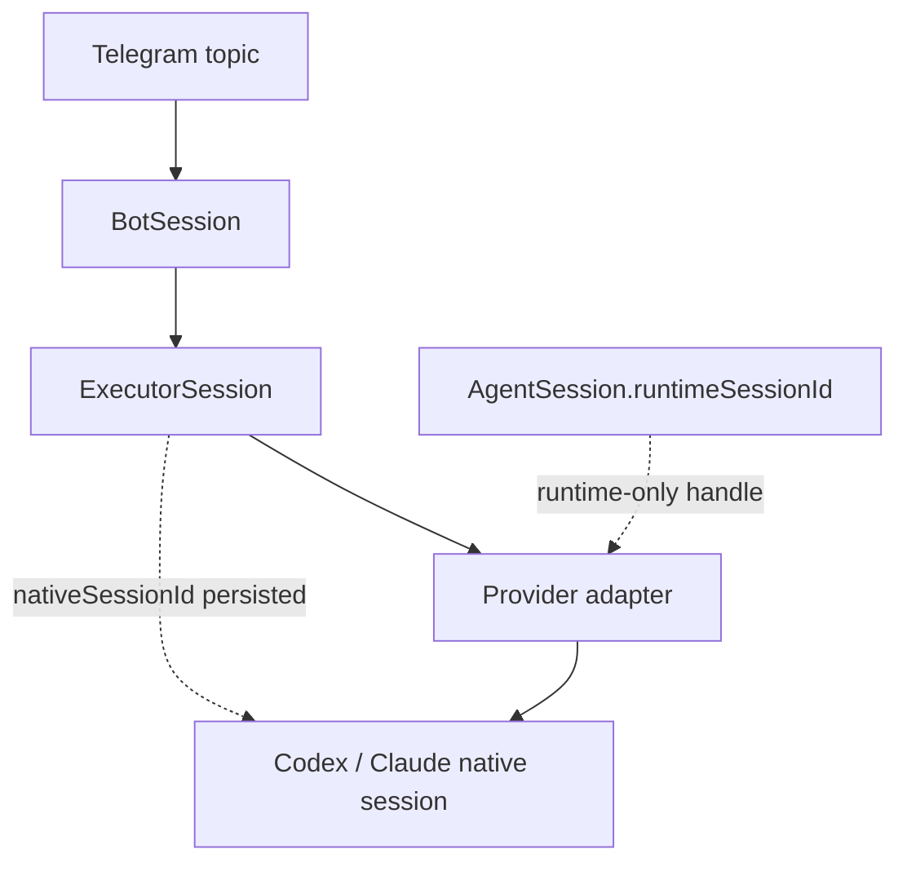

# Architettura

## Boundary

Il core conosce solo `AgentExecutor`, `AgentEvent`, repository e `ChatGateway`. Telegram è un inbound/outbound adapter; ogni CLI è un adapter di executor; SQLite è un adapter di persistence. La composition root in `src/main.ts` collega le implementazioni.

La gerarchia Telegram è:

```text
Supergroup forum
├── Control                 TelegramTopic(kind=control)
├── [Codex] ai-office · PR61   TelegramTopic → BotSession → ExecutorSession → runtime AgentSession
├── [Claude] ai-office · storage
└── [Codex] autoepoque · PR98
```

`chatId + threadId` è una chiave persistente di routing. Un topic operativo indica un logical workspace/session, non un provider: il provider è `BotSession.executorId`.



Le due frecce verso sessioni runtime/native sono intenzionalmente distinte.

## Modello di dominio

- `Project`: allowlist di workspace e executor consentiti.
- `BotSession`: identità logica del topic; lega progetto, executor e directory controllata.
- `Execution`: singolo prompt/run, con stato, correlation ID, utente e tempi.
- `AgentSession`: handle runtime del provider (`runtimeSessionId`), valido solo per l’executor corrente.
- `ExecutorSession`: record persistito con `executorId`, optional `nativeSessionId`, progetto/workspace, host, `resumable`, `createdAt` e `lastUsedAt`; il native ID non viene inventato prima che il provider lo riveli.
- `BotSession.executorSessionId` e `Execution.executorSessionId` indicano il record persistito, non un runtime handle o un native provider ID.
- `TelegramTopic`: mapping e stato del topic, inclusi `control`, `closed` e `deleted`.
- `ApprovalRequest`: contratto per mediare approval native dell’executor in una futura UI inline.
- `ExecutionReconciliation`: record one-to-one immutabile che registra l’asserzione operativa `confirmed_completed` o `abandoned`, l’operatore, la nota e l’istante; non modifica lo storico dell’`Execution`.

La relazione importante è `BotSession 1 → N Execution`, mentre più execution possono riusare lo stesso `ExecutorSession` e quindi la stessa conversazione nativa quando `resumable` è true.

## Contratti

`AgentExecutor` espone `start`, `send`, `interrupt`, `close` e un `resume` opzionale. `ExecutorCapabilities` dichiara resume, interrupt, close, identity discovery e structured streaming; l’application layer rifiuta un resume quando la capability non è disponibile. `send` restituisce `AsyncIterable<AgentEvent>`, così il core non deve sapere se l’executor usa stdout JSONL, stdin streaming o un SDK.

Gli adapter CLI usano `ProcessRunner`, che riceve executable/argv/cwd/env/stdin e passa ad una spawn senza shell. L’environment del provider è costruito da una allowlist esplicita: `PATH`, discovery/config utente, locale/terminale e solo le variabili auth/config del provider; token Telegram, autorizzazione bot, database URL e altri secret applicativi non vengono ereditati. Gli argomenti persistiti sono validati dal provider e non diventano mai path costruiti o shell fragments.

Su POSIX ogni provider è il leader di un process group dedicato (`detached` + segnali al PID negativo del gruppo): stop/errore inviano prima un segnale gentile e poi `SIGKILL` bounded, attendendo il reap. Su Windows il runtime usa il fallback del child PID; job objects/kill-tree nativi non sono ancora parte di M2 e richiedono un follow-up.

`AgentEvent` è discriminated union: testo, thinking, tool call/result, command, file change, approval, usage, `session_identity`, error e completed. `session_identity` aggiorna la persistenza prima di continuare lo stream. `completed` e `error` sono terminali; EOF senza terminale è un protocol failure (`unknown`), mai un successo.

`ChatGateway` supporta messaggi, edit, documenti, creazione e chiusura topic. La Bot API usa `message_thread_id`; non è presente nel dominio applicativo oltre agli adapter e alla chiave persistente.

## Lifecycle

M2 aveva questa esecuzione logica:

```text
pending
  → BotSession starting
  → running
  → awaiting_approval (eventuale)
  → completed | failed | stopped | unknown
```

`failed` significa che il provider/application ha osservato un fallimento terminale. `unknown` significa invece che il sistema non può provare se il provider abbia completato, eseguito parzialmente o non eseguito il lavoro: la presenza di un native session ID o la scomparsa del processo non è una prova. Per questo `unknown` non viene ritrasmesso né trasformato in `completed` o `failed`.

Lo stato autorevole di Execution, BotSession, ExecutorSession e audit è persistito in SQLite. Prima di M3, invece, la coda per sessione, active, gli AbortController, i runtime handle provider e la conoscenza dei processi in corso vivevano solo nella memoria del processo. Un restart poteva quindi perdere prompt pending, ownership e intenti di cancellation; i PID non erano una fonte di recovery affidabile.

M3 separa intent durable e delivery:

```text
Telegram update
  → persist immutable Execution(pending) + durable delivery intent atomically
  → idempotent enqueue nudge for { executionId } in SQLite execution_jobs
  → worker reloads SQLite state
  → atomic claim(session serialization + ownerId + monotonic ownerFence + lease)
  → BotSession starting/running
  → AgentExecutor.start/resume with persisted native identity
  → stream events and fenced persistence
  → completed | failed | stopped | unknown
  → queue job acknowledged
```

ExecutionJobQueue e ExecutionJobWorker sono porte applicative; l’application layer non conosce BullMQ, Redis o lo schema della coda. La composizione M3 usa un worker SQLite con concorrenza configurabile. SQLite resta la verità per execution, sessioni, identity native, cancellation e ownership; la tabella job trasporta soltanto l’intent stabile executionId.

La claim atomica impedisce due execution attive per lo stesso BotSession, mentre worker slot diversi possono eseguire sessioni diverse. Ogni lease renewal e ogni update autorevole verifica ownerId + ownerFence; un worker stale non può finalizzare o mutare l’execution dopo un nuovo claim. Il lease di `execution_jobs` governa la consegna durevole; il lease con fence di `executions` governa l’autorità sulle mutazioni di orchestrazione. La redelivery di un job scaduto può reclamare solo la consegna: se anche l’Execution è scaduta, `claim` la riconcilia come `unknown` senza riavviare il provider. La claim rifiuta inoltre qualsiasi execution pending quando esiste un `unknown` senza record in `execution_reconciliations`, anche con job già persistito o da un altro handle SQLite; il job resta retryable con backoff bounded e non raggiunge il provider.

## Capability reali verificate

Versioni verificate durante M2: `codex-cli 0.155.1`, `Claude Code 2.1.280`, `Bun 1.4.2`.

| Aspetto  | Codex                                        | Claude Code                                                                                    |
| -------- | -------------------------------------------- | ---------------------------------------------------------------------------------------------- |
| fresh    | `codex exec --json ... -`; prompt su stdin   | `claude -p --output-format stream-json --input-format stream-json`; user message JSON su stdin |
| identity | `thread.started.thread_id`                   | `system` + `subtype=init` + `session_id`                                                       |
| resume   | `codex exec resume <native-id> --json ... -` | `claude -p ... --resume <native-id>`                                                           |
| terminal | `turn.completed`, exit code                  | `result` success/error, exit code                                                              |

Gli adapter validano gli eventi richiesti, tollerano campi aggiuntivi e trasformano output sconosciuto/malformed in provider protocol errors. L’identity è emessa appena disponibile; l’application layer confronta l’ID con quello persistito, audita `execution.session_identity_conflict` una sola volta e non sostituisce l’ID salvato. Gli eventuali `agent_session_id` pre-M2 sono conservati come `legacyRuntimeSessionId` non resumable, mai trattati come native Codex/Claude ID.

Le permission prompt interattive non vengono ricostruite da testo umano: Claude usa `--permission-prompts none` in questa slice e le capability approvals restano false.

## Recovery, `/session` e cancellation

Dopo restart, M3 esegue una recovery deterministica prima di avviare il worker:

- execution `pending` viene resa nuovamente claimable e il suo solo `executionId` viene re-enqueued;
- execution `running` o `awaiting_approval` viene chiusa come `unknown` con audit `execution.recovered_unknown`; non si deduce lo stato dal PID e non si riavvia un prompt potenzialmente parzialmente eseguito;
- un lease contiene `ownerId`, `ownerFence` monotono e scadenza; update/terminalizzazione con fence stale falliscono senza effetti;
- cancellation intent è persistito prima di interrompere il runtime. Un job pending cancellato diventa `stopped` senza avviare il provider; un job running viene osservato anche da un worker diverso e riceve abort/interrupt.
- ogni transizione a `unknown` mette il BotSession in quarantena visibile (`failed`, salvo `closed`) e audita `execution.reconciliation_required`; `/status` distingue l’ambiguità da un normale failure;
- `/reconcile` e `/reconcile status` sono read-only per `viewer+`. `/reconcile <execution-id> complete <reason>` registra `confirmed_completed`, mentre `abandon <reason>` registra `abandoned`; entrambe richiedono `operator+`, una nota non vuota e una sola riga immutabile per execution. Dopo l’ultima reconciliation la sessione torna `idle`, se non è `closed`, e il lavoro pending può riprendere;
- la reconciliation è un acknowledgement umano, non una prova provider: non esegue start, resume, send, interrupt, close, inspect o replay. L’Execution originale rimane `unknown` e qualsiasi retry futuro è un nuovo execution.

`BotSession.executorSessionId` continua a ricaricare `ExecutorSession.nativeSessionId`; l’identità native M2 resta autorevole e non viene sostituita durante resume o stream. `/session` mostra topic Telegram, runtime ID se attivo, executor, native ID, stato, execution attiva e supporto resume; non mostra environment, token, raw argv o path sensibili.

`ProcessRunner` conserva graceful termination e bounded `SIGKILL`. L’EOF osservato dopo abort resta `stopped`; EOF senza terminale resta `unknown`. `/close` consulta lo stato persistito e rifiuta un execution active anche se il worker appartiene a un altro processo.

## Deferred

Approval inline, attachment storage, worktree lifecycle, reconciliation di rename/close/delete dei topic, PostgreSQL/Supabase, Redis/BullMQ come trasporto alternativo e multi-host process supervision restano fuori da M4. Il polling corrente normalizza solo messaggi testuali.
