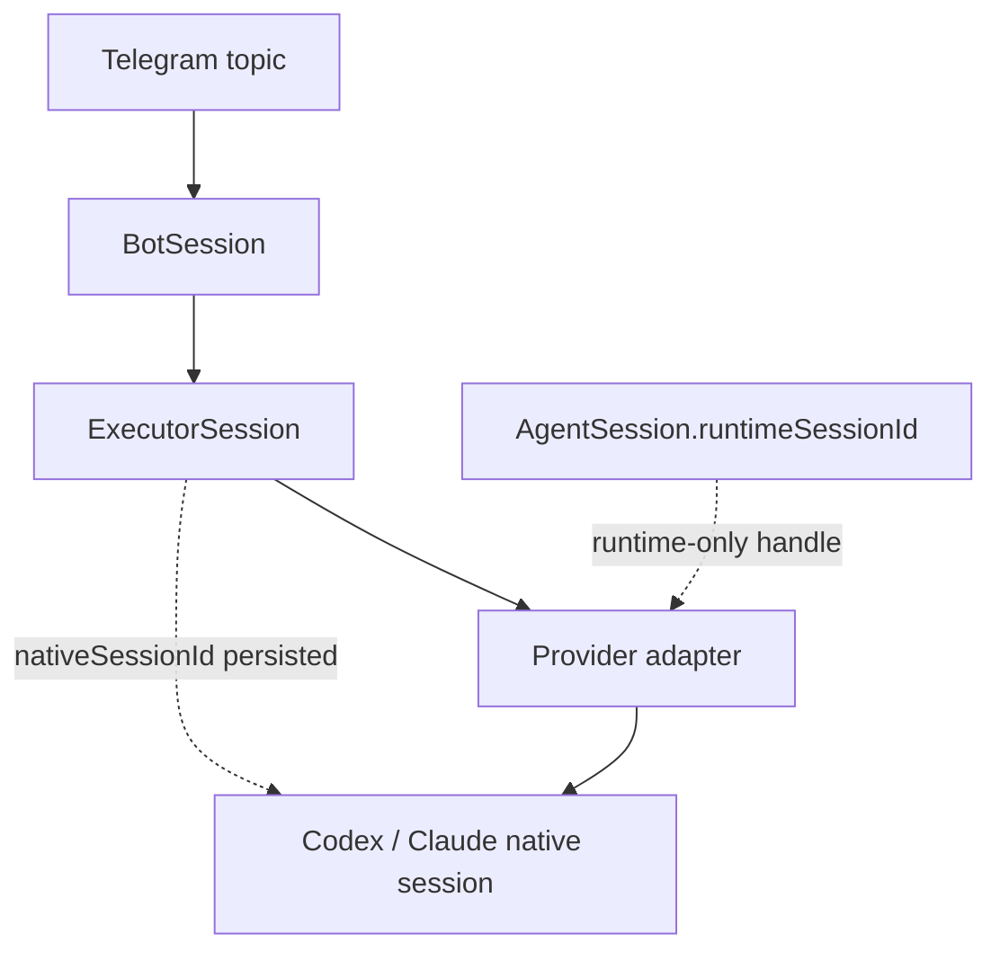

# Architettura

## Boundary

Il core conosce solo `AgentExecutor`, `AgentEvent`, repository e `ChatGateway`. Telegram è un inbound/outbound adapter; ogni CLI è un adapter di executor; SQLite è un adapter di persistence. La composition root in `src/main.ts` collega le implementazioni.

La gerarchia Telegram è:

```text
Supergroup forum
├── Control                 TelegramTopic(kind=control)
├── [Codex] ai-office · PR61   TelegramTopic → BotSession → ExecutorSession → runtime AgentSession
├── [Claude] ai-office · storage
└── [Codex] autoepoque · PR98
```

`chatId + threadId` è una chiave persistente di routing. Un topic operativo indica un logical workspace/session, non un provider: il provider è `BotSession.executorId`.



Le due frecce verso sessioni runtime/native sono intenzionalmente distinte.

## Modello di dominio

- `Project`: allowlist di workspace e executor consentiti.
- `BotSession`: identità logica del topic; lega progetto, executor e directory controllata.
- `Execution`: singolo prompt/run, con stato, correlation ID, utente e tempi.
- `AgentSession`: handle runtime del provider (`runtimeSessionId`), valido solo per l’executor corrente.
- `ExecutorSession`: record persistito con `executorId`, optional `nativeSessionId`, progetto/workspace, host, `resumable`, `createdAt` e `lastUsedAt`; il native ID non viene inventato prima che il provider lo riveli.
- `BotSession.executorSessionId` e `Execution.executorSessionId` indicano il record persistito, non un runtime handle o un native provider ID.
- `TelegramTopic`: mapping e stato del topic, inclusi `control`, `closed` e `deleted`.
- `ApprovalRequest`: contratto per mediare approval native dell’executor in una futura UI inline.

La relazione importante è `BotSession 1 → N Execution`, mentre più execution possono riusare lo stesso `ExecutorSession` e quindi la stessa conversazione nativa quando `resumable` è true.

## Contratti

`AgentExecutor` espone `start`, `send`, `interrupt`, `close` e un `resume` opzionale. `ExecutorCapabilities` dichiara resume, interrupt, close, identity discovery e structured streaming; l’application layer rifiuta un resume quando la capability non è disponibile. `send` restituisce `AsyncIterable<AgentEvent>`, così il core non deve sapere se l’executor usa stdout JSONL, stdin streaming o un SDK.

Gli adapter CLI usano `ProcessRunner`, che riceve executable/argv/cwd/env/stdin e passa ad una spawn senza shell. L’environment del provider è costruito da una allowlist esplicita: `PATH`, discovery/config utente, locale/terminale e solo le variabili auth/config del provider; token Telegram, autorizzazione bot, database URL e altri secret applicativi non vengono ereditati. Gli argomenti persistiti sono validati dal provider e non diventano mai path costruiti o shell fragments.

Su POSIX ogni provider è il leader di un process group dedicato (`detached` + segnali al PID negativo del gruppo): stop/errore inviano prima un segnale gentile e poi `SIGKILL` bounded, attendendo il reap. Su Windows il runtime usa il fallback del child PID; job objects/kill-tree nativi non sono ancora parte di M2 e richiedono un follow-up.

`AgentEvent` è discriminated union: testo, thinking, tool call/result, command, file change, approval, usage, `session_identity`, error e completed. `session_identity` aggiorna la persistenza prima di continuare lo stream. `completed` e `error` sono terminali; EOF senza terminale è un protocol failure (`unknown`), mai un successo.

`ChatGateway` supporta messaggi, edit, documenti, creazione e chiusura topic. La Bot API usa `message_thread_id`; non è presente nel dominio applicativo oltre agli adapter e alla chiave persistente.

## Lifecycle

```text
Telegram update
  → Telegram adapter normalizza chatId/threadId/userId/text
  → TelegramTopic/BotSession lookup
  → AuthorizationService (chat + user ID + ruolo)
  → supervised task dispatch (polling non attende l’executor)
  → SessionQueue serializza per BotSession; topic diversi possono procedere in parallelo
  → reload authoritative BotSession dentro la coda
  → Execution pending → starting/running
  → ExecutorRegistry seleziona adapter
  → AgentExecutor.start/resume con AbortSignal
  → AgentExecutor.send → ProcessRunner.spawn senza shell
  → AgentEvent normalizzati
  → `session_identity` → persist native ID immediatamente
  → ThrottledEventRenderer aggiorna un solo messaggio
  → terminal event/abort/EOF → Execution completed/failed/stopped/unknown + BotSession idle/failed/stopped
  → audit + persistence
```

Una seconda richiesta nello stesso topic aspetta la prima; topic diversi non condividono la coda.

## Capability reali verificate

Versioni verificate durante M2: `codex-cli 0.155.1`, `Claude Code 2.1.280`, `Bun 1.4.2`.

| Aspetto  | Codex                                        | Claude Code                                                                                    |
| -------- | -------------------------------------------- | ---------------------------------------------------------------------------------------------- |
| fresh    | `codex exec --json ... -`; prompt su stdin   | `claude -p --output-format stream-json --input-format stream-json`; user message JSON su stdin |
| identity | `thread.started.thread_id`                   | `system` + `subtype=init` + `session_id`                                                       |
| resume   | `codex exec resume <native-id> --json ... -` | `claude -p ... --resume <native-id>`                                                           |
| terminal | `turn.completed`, exit code                  | `result` success/error, exit code                                                              |

Gli adapter validano gli eventi richiesti, tollerano campi aggiuntivi e trasformano output sconosciuto/malformed in provider protocol errors. L’identity è emessa appena disponibile; l’application layer confronta l’ID con quello persistito, audita `execution.session_identity_conflict` una sola volta e non sostituisce l’ID salvato. Gli eventuali `agent_session_id` pre-M2 sono conservati come `legacyRuntimeSessionId` non resumable, mai trattati come native Codex/Claude ID.

Le permission prompt interattive non vengono ricostruite da testo umano: Claude usa `--permission-prompts none` in questa slice e le capability approvals restano false.

## Recovery, `/session` e cancellation

Dopo restart, `BotSession.executorSessionId` ricarica `ExecutorSession.nativeSessionId`; se l’ID esiste ma resume non è supportato, l’execution fallisce chiusa e l’adapter non avvia una sessione nuova. `/session` mostra topic Telegram, runtime ID se attivo, executor, native ID, stato, execution attiva e supporto resume; non mostra environment, token, raw argv o path sensibili.

`/stop` stabilisce l’autorità di cancellazione prima di `start`/`resume`, passa il signal a start/resume/send, invia `interrupt` quando esiste un runtime handle e persiste `stopped`. `ProcessRunner` chiede graceful termination, poi forza `SIGKILL` dopo una grace period iniettata. L’EOF osservato dopo abort resta `stopped`; EOF senza terminale resta `unknown`. `/close` è serializzato e rifiuta un execution attivo.

## Deferred

Approval inline, attachment storage, worktree lifecycle, webhook Telegram e reconciliation di rename/close/delete dei topic, PostgreSQL/Supabase, recovery dei PID e Redis/BullMQ sono fuori da M2. Il polling corrente normalizza solo messaggi testuali.
